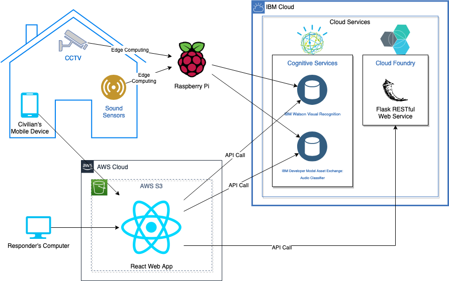

# SCDF Call for Code 2020 - Dr. Watson
**Problem Statement: Integrating with a Smart Environment**

Team Members: [Jane Seah](https://github.com/shingkid), [Lim Pei Xuan](https://github.com/ellpeeaxe), [Ong Yan Kai](https://github.com/yankai364), [Patrick Lim](https://github.com/plyh), [Vinnie Chu](https://github.com/ballchuuu)

## Short description
### What is the problem?

In times of emergencies, such as fire breakout, there is a need for more on-the-ground intelligence for effective decision-making. 

Currently, for the people within the building, especially those that are panicking and not familiar with the layout of the building, there are a few possible scenarios that could still put them at risk of running to a chokepoint or dangerous zones:

* Lack of familiarity with the building layout
* Lack of real-time information of blockages from the fire and alternative exit routes
* Stranding due to mobility constraints

For the first responders on the ground such as security or nearby First Responders, the priority would be to rush to the key areas that need help directing people to the nearest safest exit or areas where there is a need for assistance, such as people with disabilities. However, current CCTVs are not intelligent in tracking areas and people that need assistance, wasting security and management’s time for an effective on the ground evacuation efforts. 

As for the SCDF emergency team rushing to the incident site, they also face a series of challenges in planning and executing a quick and effective rescue plan:

* There is an information lag as they rely on the information provided by the caller/witnesses at the scene (i.e. Occupants at risk may have moved from their last known location)

* Insufficient real-time overview of the situation and damage to formulate a clear rescue plan
	* Lack of information of structural damages and blockages increase time to search for rescue routes 
	* No clear latest situation of where the trapped people are 

Having all these vital information for the different parties have great potential in significantly reducing the casualties in times of emergency like a fire breakout. 

### Our Solution
Our team believes that with the rise of "Smart" Infrastructure, we can leverage existing and upcoming technologies to address these challenges. We have built a prototype evacuation and rescue system that makes use of smart intelligence collected from various data sources in the smart building to provide a clear, real-time situation on the ground through a 3-D building dashboard, highlighting the vital information for quick and effective decision-making by the first-responders and rescuers. The real-time intelligence also provides data to generate the safest and fastest evacuation routes for the people in the building. 

To efficiently and safely evacuate occupants when a fire is detected, the system will make use of WiFi Triangulation to locate occupants and serve personalised optimal escape routes directly to their devices. The algorithm will tap on the data from sensors and CCTV cameras to determine which zones are unsafe/blocked and compute the best route to safety accordingly.

Upon the actuation of the fire alarm, the responders will have access to a dashboard with real-time updates of the situation at the site. The CCTV footage from the site will be processed to automatically identify (Computer Vision) zones that still contain a high number of occupants, as well as the zones where people with mobility impairments were detected (e.g. wheelchair bound occupants). The dashboard will also contain a route finder that computes the fastest and safest way to move between any zone in the building, taking into account damage and blockages.

Our solution prototype could be implemented in existing or new buildings, as long as they have the infrastructure required (WiFi, CCTV Cameras and smoke/fire sensors).

## Pitch Video
Pitch Video link here

## Solution Architecture


## Detailed Solution
[Read more](https://docs.google.com/document/d/11p-nnQ6YOiT5O3a395TWuMCOUkPPU2C8k-vCn7XmnOs/edit?usp=sharing)

## Getting Started
(Step-by-step instructions to install the required software and how
to run a demo of your solution)

```sh
pip install requirements.txt
```

### Flask RESTful Web Service
**Find optimal route**
From Exit 4 to Corridor 3-1
```sh
curl -i "https://dr-watson.us-south.cf.appdomain.cloud/route?origin=Exit_4&destination=C3-1"
```

To Corridor 3-1
```sh
curl -i "https://dr-watson.us-south.cf.appdomain.cloud/route?destination=C3-1"
```

From Exit 4
```sh
curl -i "https://dr-watson.us-south.cf.appdomain.cloud/route?origin=C3-1"
```

**Update compromised zones**
```sh
curl -X PATCH "https://dr-watson.us-south.cf.appdomain.cloud/compromised?zones[]=C2-1&zones[]=C3-1"
```

**Reset zones**
```sh
curl -i "https://dr-watson.us-south.cf.appdomain.cloud/refresh"
```

## Running the Tests
Running the tests (Explanation and breakdown on how to run tests for the proposed
solution)

## Proof of Concept
(Link to an actual working demo/website)
[React web app](http://dr-watson-to-the-rescue.s3-website-ap-southeast-1.amazonaws.com/admin/index)

## Tools and Technologies
IBM Cloud Foundry, Python 3
